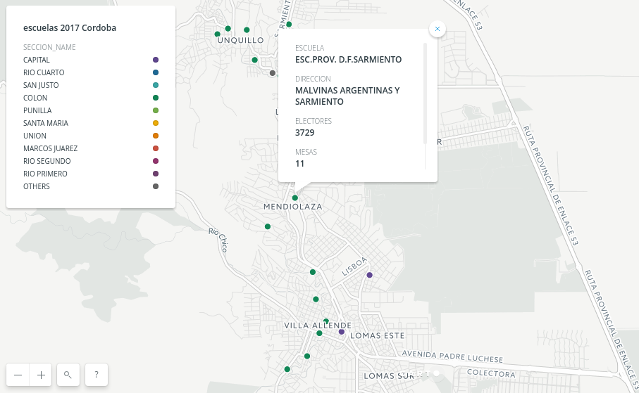
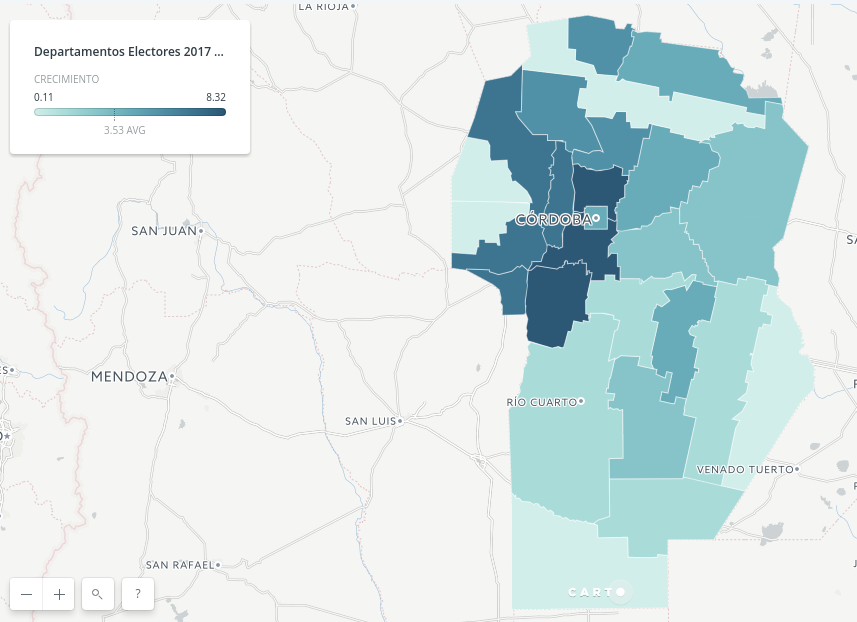

# Carta Marina Córdoba 2017

Procesamiento de la Carta Marina Cordoba 2017

Se inicia el proceso con la [Carta Marina Cordoba 2017 publicada en PDF](res/LugaresDeVotacion-elecciones-2017.pdf).  

Como este PDF no permite una lectura correcta se usa el script _pdftotext_ que permite obtener el texto a secas del archivo PDF.  

```
pdftotext -layout LugaresDeVotacion-elecciones-2017.pdf carta-marina-cordoba-2017.txt
# notese el -layout, es clave
```
Luego este texto se convierte a CSV vía:  

```
python3 carta-marina-process.py
```
Este script esta adaptado de [uno similar hecho en 2015](https://github.com/OpenDataCordoba/elecciones2015/blob/master/resources/carta-marina/CartaMarinaProcess.py).  
La Carta Marina no es muy precisa en el orden de las escuelas y es posible que requiera toques a mano.  
Muchas direcciones tienen formas complicadas por lo que el retoque final a mano puede ser necesario. La detección de barrios (muchas veces metido entre la calle y el numero (?)) podría hacerce con expresiones regulares y simplificar este proceso.   
Dentro de google sheets se geolocalizaron las escuelas con [este script](https://github.com/ModernizacionMuniCBA/muni-google-util-app-scripts/tree/master/geolocalizar%20desde%20direccion) liberado desde la Municipalidad de Córdoba.  

Con esta geolocalización quedo disponible [un CSV](res/escuelas-elecciones-2017-cordoba-Geolocalizada.csv).  
De aquí puede hacerse un [mapa](https://hudson.carto.com/builder/830a70f8-82b0-4834-8410-81d0ebc44064/embed).  



Con esos datos junto a los de 2015 se armó una lista de variaciones de electores por sección (departamento) y por circuito (generalmente ciudades).  

[CSV variación por departamentos](res/Electores-2017-vs-2015-por-departamentos.csv).  
[CSV variación por circuitos](res/Electores-2017-vs-2015-por-Circuitos.csv).  


### Mapa variación de departamentos

Según el [mapa de departamentos de Córdoba](https://www.google.com/maps/d/view?mid=1v7Nc5p2DMDJZuZspiUaYKO-jvKA) se puede construir uno con los valores obtenidos.  

Se extraen a [CSV con polígonos WKT](res/Departamentos_Provincia_de_Córdoba_2010.csv) (o una versión con [polígonos simplificados](res/Departamentos_Provincia_de_Córdoba_2010-SIMPLIFICADO.csv))y luego se mezclan en otro [nuevo CSV con datos y poligonos](res/2017-vs-2015 departamentos-WKT.csv) que puede subirse a Carto:   



[VER MAPA](https://hudson.carto.com/builder/bbae0c77-1d33-40e3-b8c0-4876df33a4c4/embed).  

Más: [Verión KML de los resultados](res/Departamentos-Cordoba-2015-vs-2017.kml)